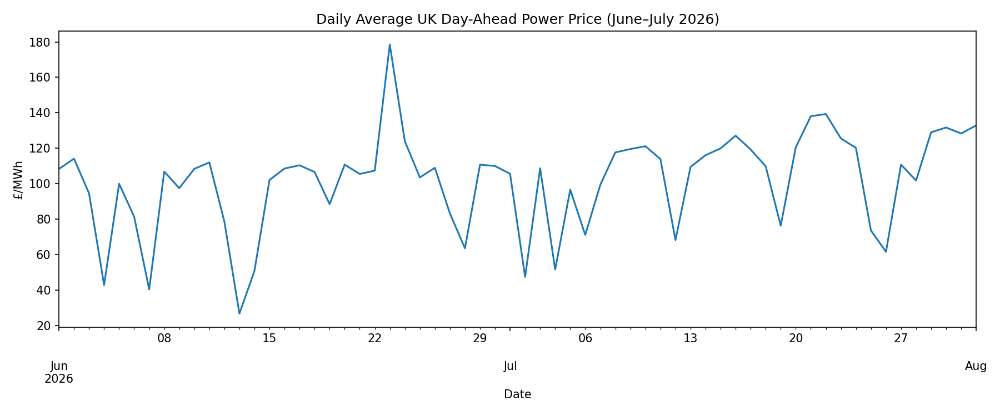
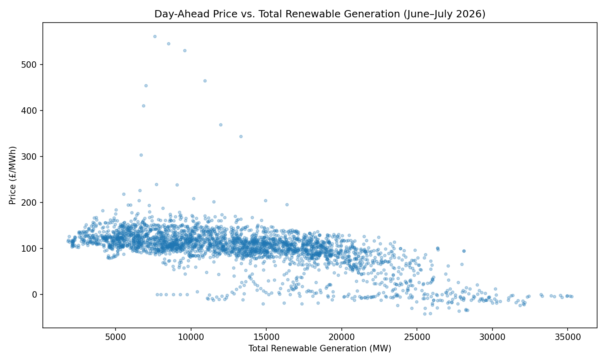

# UK Day-Ahead Power Price Analysis

## What this does

Pulls GB day-ahead wholesale power prices and wind/solar generation forecasts from Elexon's public BMRS API, cleans and merges them, and investigates how renewable generation relates to price — including where that relationship breaks down.

## Data

- **Price**: Elexon Market Index Data (half-hourly day-ahead price), June–July 2026
- **Generation**: Elexon Day-Ahead Generation Forecast for Wind and Solar (DGWS/B1440), same period
- Source: Elexon Insights Solution API (public, no key required) — https://developer.data.elexon.co.uk/

## Data cleaning notes

- The price feed includes two reporting providers, APX and N2EX. N2EX returned no valid price values for this period, so only APX data was used.
- Solar, Wind Onshore and Wind Offshore are reported as separate rows per settlement period and were summed into a single total renewable generation figure.
- Both API endpoints cap requests at 7 days per call, so data was pulled in weekly chunks and concatenated.

## Key findings

**1. Renewable generation and price are strongly negatively correlated.**
Across ~2,930 half-hourly periods (June–July 2026), day-ahead price and total renewable generation showed a correlation of **-0.60**, consistent with the merit-order effect: higher renewable output pushes cheaper generation to the margin and lowers the wholesale price. At low renewable output, prices cluster mostly £100–150/MWh with occasional spikes above £450. At high output (25,000+ MW), prices compress toward £0–50/MWh.

**2. Off-peak prices were, on average, higher than peak prices — the opposite of the conventional assumption.**
Using a standard peak definition (weekdays, 07:00–19:00), average peak-hour price was **£7.76/MWh lower** than off-peak. This traces back to finding 1: solar generation is concentrated almost entirely within the defined peak window (average 7,777 MW during peak vs. 2,215 MW off-peak), so cheap solar is suppressing prices during the hours that would traditionally carry a demand premium.

**3. Nine of the ten highest half-hourly prices in the dataset occurred on a single evening.**
The two-month maximum was £560.81/MWh at 19:30 on 23 June — and 9 of the 10 highest prices overall fall between 17:00 and 21:00 that same evening, with renewable generation in a normal range throughout (roughly 6,700–13,300 MW, not an extreme low). This points to a demand-driven event specific to that evening rather than a general pattern of renewables scarcity driving extreme prices. England played a 9pm World Cup match that evening, which is a plausible contributing factor to elevated early-evening demand — though price had already begun falling by kick-off, and this hasn't been tested against actual demand data, so it remains a hypothesis rather than a confirmed cause. It's a useful reminder that the -0.60 correlation is real but partial: price is driven by more than renewable supply alone, and daily averages can mask what's actually happening within a day.

## Visualizations

## Limitations / next steps

- Two months of data from one summer period — seasonal patterns (e.g. winter demand, different solar output) aren't captured
- No demand data included yet; adding it would allow renewable supply and demand — and potential one-off demand events like major sporting fixtures — to be tested as separate, comparable drivers rather than inferring demand from time of day
- Peak/off-peak split uses a standard fixed definition (weekdays 07:00–19:00) rather than testing alternative windows
- The 24 June spike investigation used a single data point; a systematic look at all high-price periods would give a more robust view of what drives extremes

## How to run

1. Install dependencies: `pip install pandas requests matplotlib`
2. Open `analysis.ipynb` in Jupyter or Google Colab
3. Run cells in order — the notebook fetches data live from Elexon's public API
